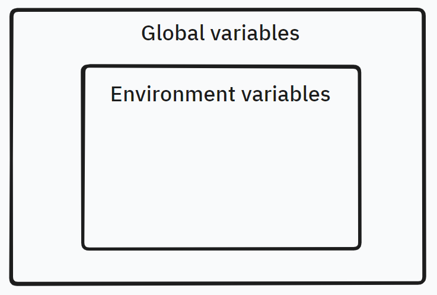

# Environment Variables Manager

The _Environment Variables Manager_ in API Dash allows you to store and reuse values efficiently. It enables you to manage variables and easily switch between different sets of variables.

## Variable Scopes

API Dash provides two scopes of variables:

- **Global variables :** Variables declared in this scope are available regardless of the current active environment.
- **Environment cariables:** Variables declared in a particular environment are available only when that environment is set as active.

### Scope Hierarchy

**Environment Scope takes precedence over Global Scope.**

If a variable with the same name exists in both the Global and Environment Scopes, and the environment is active, the value from the Environment Scope will be used.

#### Example

Suppose you have a variable named `API_URL` defined in both the Global Scope and an Environment Scope (e.g., `Development`).

- Global Scope:
  - `API_UR`L = `https://api.foss42.com`
- Development Environment Scope:
  - `API_URL` = `https://api.apidash.dev`

If the `Development` environment is active, `https://api.apidash.dev.com` will be used as the `API_URL`. If no environment is active, or if a different environment is active, the Global Scope value `https://api.foss42.com` will be used.
